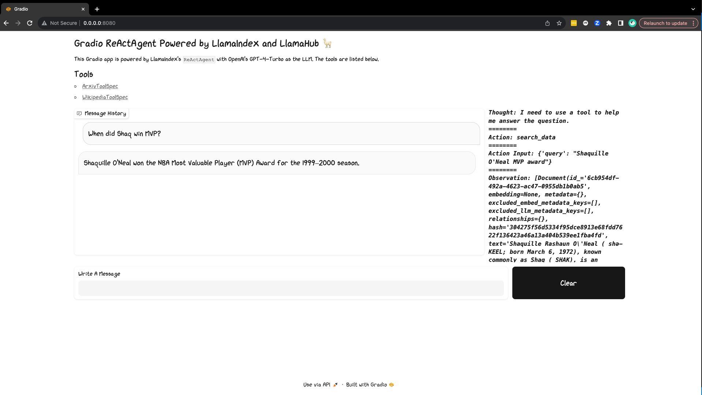

# Gradio ReActAgent Chatbot Pack

Create a ReActAgent Chatbot equipped with two LlamaHub tools, namely: 
[ArxivToolSpec](https://llamahub.ai/l/tools-arxiv) and Wikipedia tool and
[WikipediaToolSpec](https://llamahub.ai/l/tools-wikipedia).



This pack's Gradio app is built with Gradio `Blocks`. User messages are submitted
via a `TextBox` Block, which are then handled by a LlamaIndex `ReActAgent` to generate a
response (calling required tools). The result is then sent to a `Chatbot` Block —
additionally the agent's thoughts are captured in an `HTML` Block.

## Usage

You can download the pack to a `./gradio_react_agent_chatbot` directory:

```python
from llama_index.llama_packs import download_llama_pack

# download and install dependencies
GradioReactAgentPack = download_llama_pack(
  "GradioReactAgentPack", "./gradio_react_agent_pack"
)
```

From here, you can inspect and modify the pack in `./gradio_react_agent_pack`.

To run the app directly, use in your terminal:

```bash
python ./gradio_react_agent_pack/base.py
```
