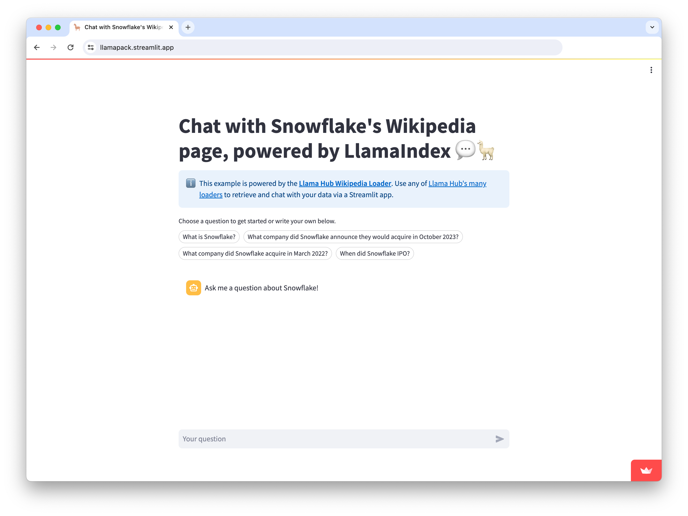

# Steamlit Chatbot Pack

Build a chatbot powered by LlamaIndex that augments an LLM with the contents of Snowflake's Wikipedia page (or your own data).



- Takes user queries via Streamlit's `st.chat_input` and displays both user queries and model responses with `st.chat_message`
- Uses LlamaIndex to load and index data and create a chat engine that will retrieve context from that data to respond to each user query
- UI will stream each answer from the LLM

## Usage

You can download the pack to a `./streamlit_chatbot_pack` directory:

```python
from llama_index.llama_packs import download_llama_pack

# download and install dependencies
StreamlitChatPack = download_llama_pack(
  "StreamlitChatPack", "./streamlit_chatbot_pack"
)
```

From here, you can inspect and modify the pack in `./streamlit_chatbot_pack`.

To run the app directly, use in your terminal:

```bash
streamlit run ./streamlit_chatbot_pack/base.py
```
